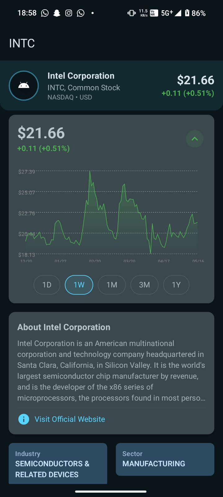
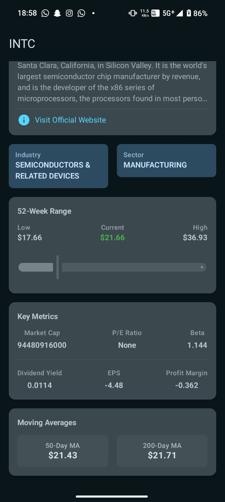
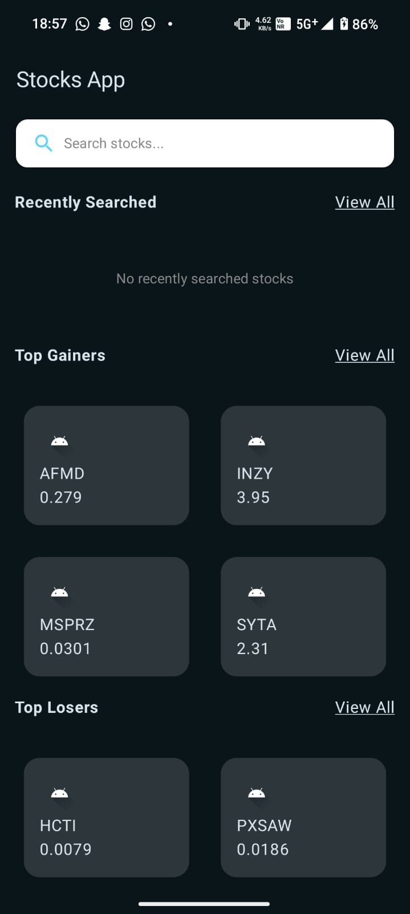
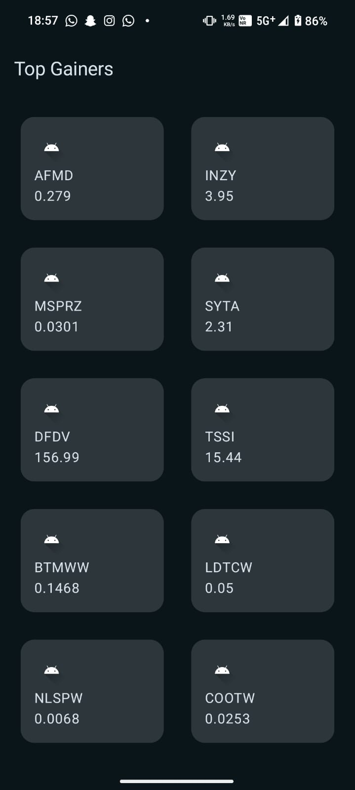
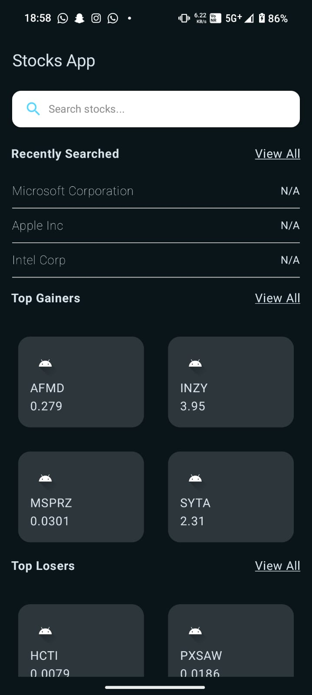
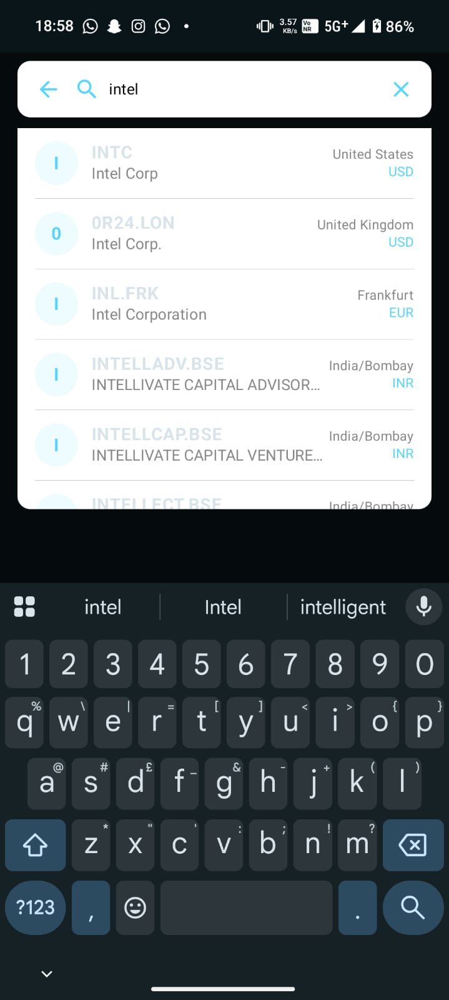
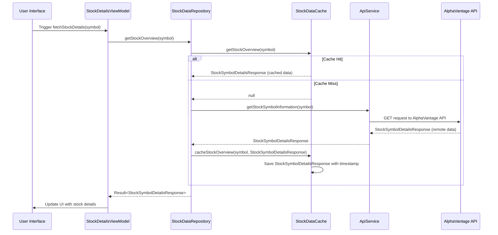

# GrowwTask - Android Stock Portfolio App

GrowwTask is an Android application built with Kotlin and Jetpack Compose that allows users to explore stock market data, including top gainers, top losers, and individual stock details. It utilizes a clean architecture with Hilt for dependency injection, Ktor for networking, and a local data cache for improved performance.

## Summary [ To save your time ]
 - It fetches data from the Alpha Vantage api for top movers and losers on the Explore Screen. Clicking View All takes you to ViewAllScreen,
where you see all the data (Pagination not required due to data being limited).
 - A search bar that leverages ticker search to provide search functionality using coroutine jobs to make it efficient.
 - The Recently searched section, which shows the last 3 searches that persist in the preference datastore. By clicking View All, you can watch the last 20.
 - 
- Clicking an individual stock caches it and then shows you a detailed screen with the key metrics obtained and a line chart in DAILY_TIME_SERIES mapped using canvas to show the price variation over time. 
- Error handling and UIStates are managed all along.
- Material theme design.
- Jetpack Compose-based UI.
- MVVM architecture

## Screenshots

    
    

## Key Features

*   **Browse Top Movers:** Discover top gainers and losers in the stock market.
*   **Search Stocks:** Find specific stocks by symbol or name.
*   **View Stock Details:** Access detailed information about individual stocks, including key metrics, historical price data, and company information.
*   **Recently Searched Stocks:** Keep track of stocks you've recently searched for quick access.
*   **Pull-to-Refresh:** Refresh stock data to get the latest information.

## Architecture

The app follows a clean architecture to ensure maintainability, testability, and scalability. The main layers are:

*   **Presentation Layer:** Contains the UI components, ViewModels, and navigation logic. Built with Jetpack Compose.
*   **Domain Layer:** Contains the business logic and use cases.
*   **Data Layer:** Handles data retrieval from remote and local sources.

Here's a sequence diagram illustrating the data flow when fetching stock details:



# Core Functionalities

## 1. Networking with Ktor
The app uses Ktor to make network requests to the Alpha Vantage API. ApiService.kt encapsulates the API calls:

// From app/src/main/java/com/example/growwtask/data/network/ApiService.kt
```
class ApiService(private val client: HttpClient) {
    suspend fun getTopGainersAndLosers(): GetTopGainersAndLosersResponse =
        executeRequest(
            function = "TOP_GAINERS_LOSERS"
        )

    suspend fun getStockSymbolInformation(symbol: String): StockSymbolDetailsResponse =
        executeRequest(
            function = "OVERVIEW",
            parameters = mapOf("symbol" to symbol)
        )

    // ... other API calls
}
```
The provideHttpClient function in NetworkModule.kt provides the HttpClient instance with JSON content negotiation.
The executeRequest function builds the request URL with the necessary parameters and API key.

## 2. Dependency Injection with Hilt

Hilt is used for dependency injection, making the code more testable and maintainable.
```
// From app/src/main/java/com/example/growwtask/GrowwTaskApplication.kt
@HiltAndroidApp
class GrowwTaskApplication : Application()
```
The GrowwTaskApplication class is annotated with @HiltAndroidApp to enable Hilt.
Modules like NetworkModule.kt and CacheModule.kt provide dependencies like HttpClient and StockDataCache.
ViewModels like ExploreViewModel and StockDetailsViewModel are annotated with @HiltViewModel to enable dependency injection.

 ## 3. Jetpack Compose UI
The app's UI is built with Jetpack Compose, a modern declarative UI toolkit for Android.
```
// From app/src/main/java/com/example/growwtask/MainActivity.kt
@AndroidEntryPoint
class MainActivity : ComponentActivity() {
    @RequiresApi(Build.VERSION_CODES.N)
    override fun onCreate(savedInstanceState: Bundle?) {
        super.onCreate(savedInstanceState)
        enableEdgeToEdge()
        setContent {
            val navController = rememberNavController()
            GrowwTaskTheme {
                NavigationGraph(navController = navController)
            }
        }
    }
}
```
MainActivity sets up the Compose UI with a NavHostController for navigation.
NavigationGraph.kt defines the navigation graph for the app.
UI components like CustomSearchBar, StockCard, and StockChart are built with Compose.

## 4. Data Caching
To improve performance and reduce API calls, the app uses a local data cache implemented with StockDataCache.kt.
```
// From app/src/main/java/com/example/growwtask/utils/StockDataCache.kt
class StockDataCache {
    private val stockOverviewCache = mutableMapOf<String, CacheEntry<StockSymbolDetailsResponse>>()
    private val stockPriceHistoryCache = mutableMapOf<String, CacheEntry<List<StockPriceData>>>()

    private val cacheExpirationTime = 15 * 60 * 1000L

    fun getStockOverview(symbol: String): StockSymbolDetailsResponse? {
        val cacheEntry = stockOverviewCache[symbol] ?: return null

        if (System.currentTimeMillis() - cacheEntry.timestamp > cacheExpirationTime) {
            stockOverviewCache.remove(symbol)
            return null
        }

        return cacheEntry.data
    }

    fun cacheStockOverview(symbol: String, data: StockSymbolDetailsResponse) {
        stockOverviewCache[symbol] = CacheEntry(data)
    }

    // ... other caching functions
}
```
The StockDataCache stores stock overview and price history data in memory.
Cache entries expire after a certain time to ensure data freshness.
The StockDataRepository checks the cache before making API calls.

## 5. Local Data Storage with DataStore

The app uses Jetpack DataStore to store recently searched stocks locally, check out StockPreferencesManager.kt
```
@Singleton
class StockPreferencesManager @Inject constructor(
    @ApplicationContext private val context: Context
) {
    private val Context.dataStore by preferencesDataStore(name = "stock_preferences")

    private val gson = Gson()

    companion object {
        private val RECENTLY_SEARCHED_KEY = stringPreferencesKey("recently_searched")
        private const val MAX_RECENT_SEARCHES = 20 // Max to store
    }
        //...
}
```
## Data Models
The app uses several data models to represent stock market data. Some of the key models include:
```
GetTopGainersAndLosersResponse.kt: Represents the response from the top gainers and losers API endpoint.
StockSymbolDetailsResponse.kt: Represents detailed information about a stock symbol.
StockPriceData.kt: Represents historical stock price data.
RecentlySearchedStock.kt: Represents a recently searched stock.
```
## UI Components
The app uses several custom UI components to provide a rich user experience. Some of the key components include:
```
CustomSearchBar.kt: A custom search bar with auto-completion and search suggestions.
StockCard.kt: A card that displays basic information about a stock.
StockChart.kt: A chart that displays historical stock price data.
```
## Getting Started
To run the app locally, follow these steps:

### Clone the repository:
```git clone [repository_url]  ```

### Open the project in Android Studio.
Add your Alpha Vantage API key to the local.properties file:
```API_KEY="YOUR_API_KEY"```
Build and run the app on an emulator or physical device.
